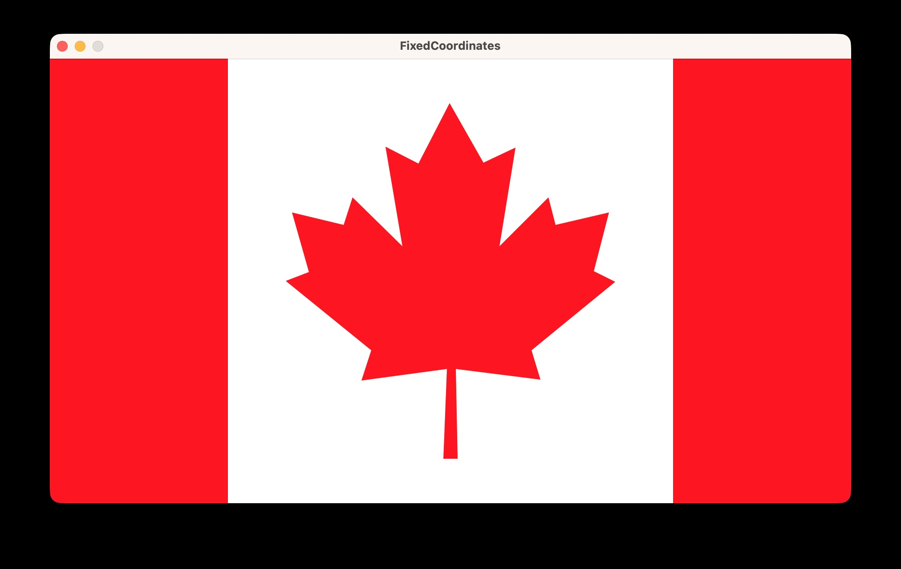

# Processing Examples: Maple Leaf

Example programs that progressively build up a Canadian flag drawing using the Processing graphics library.



## Examples

Each file in `src/` demonstrates a different approach, building on the previous one.

| # | File | Description |
|---|---|---|
| 0 | `Sketch.java` | Starter template |
| 1 | `FixedCoordinates.java` | Draws the flag using explicit, fixed coordinates |

## How to Run

1. Open this project in VSCodium.
2. Open any `.java` file in `src/`.
3. Press **Cmd-Shift-B** (macOS) or **Ctrl-Shift-B** (Windows/Linux) to compile and run.

## Folder Structure

```
Processing-Examples-Maple-Leaf/
|-- .vscode/        - editor settings for VSCodium/VS Code
|-- bin/            - compiled .class files (generated automatically)
|-- lib/            - contains core.jar (the Processing library)
+-- src/            - example programs
```